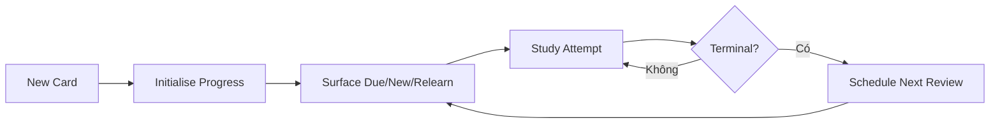

# Learning Progress business flows

Learning Progress sở hữu trạng thái học dài hạn của mỗi Card: Leitner 8 Box, due scheduling, repetitions/lapses và lịch sử attempt liên quan. Thuật toán chuẩn nằm tại [srs-8-box-policy.md](./srs-8-box-policy.md).

## Invariants

- Mỗi Card có tối đa một current scheduling state.
- Card mới ở Box 0; tám box SRS là Box 1..8.
- Interval Box 1..7 là 1, 3, 7, 14, 30, 60 và 120 ngày; Box 8 mastered không còn due.
- Cùng một Attempt không được apply hai lần.
- Scheduling update và Attempt persistence phải nhất quán.
- Attempt của mastery retry round được giữ trong history nhưng không tự schedule SRS; chỉ terminal Card outcome do Study Session xác nhận mới cập nhật scheduling state.
- Progress không thay đổi Card content hoặc Deck hierarchy.
- Reset progress không xóa Card.
- Delete Card/Deck xóa progress liên quan theo lifecycle owner.

## Main write/read path

`record-study-attempt.md` là write entry từ Session; `schedule-next-review.md` chỉ chạy với terminal outcome; `surface-due-cards.md` là read-only queue contract.

Match, Guess, Recall và Fill có thể tạo nhiều Attempt cho cùng Card qua nhiều mastery round. Các Attempt này khác identity, giữ `mode`/`roundIndex` để audit và không được double-count thành nhiều terminal outcomes.

## Flow catalog

| File | Flow sở hữu | Trạng thái |
| --- | --- | --- |
| [initialise-card-progress.md](./initialise-card-progress.md) | Trạng thái Card mới/chưa học | Đã có |
| [record-study-attempt.md](./record-study-attempt.md) | Apply answer outcome idempotently | Đã có |
| [schedule-next-review.md](./schedule-next-review.md) | Tính box và due tiếp theo theo Leitner 8 Box | Đã có |
| [srs-8-box-policy.md](./srs-8-box-policy.md) | Source of truth cho activation, terminal grade, chuyển Box và interval | Đã có |
| [surface-due-cards.md](./surface-due-cards.md) | Eligibility và due/new/relearn queues | Đã có |
| [reset-learning-progress.md](./reset-learning-progress.md) | Scope reset và atomic recovery | Đã có |
| [inspect-progress-history.md](./inspect-progress-history.md) | Read-only history cho Statistics/detail | Đã có |

## Cross-object contracts

- Nhận Card id và Attempt outcome từ Study Session.
- Trả due/new/relearn queues cho Dashboard và Study Session.
- Trả aggregate progress cho Deck/Statistics projection.
- Deck-level reset entry tuân theo `deck/reset-deck-progress.md`.

## Canonical state coverage

- New/due/relearn/learned; attempt apply/retry/conflict.
- Reset none/some/dense; offline/local-first; large counts and date boundaries.
