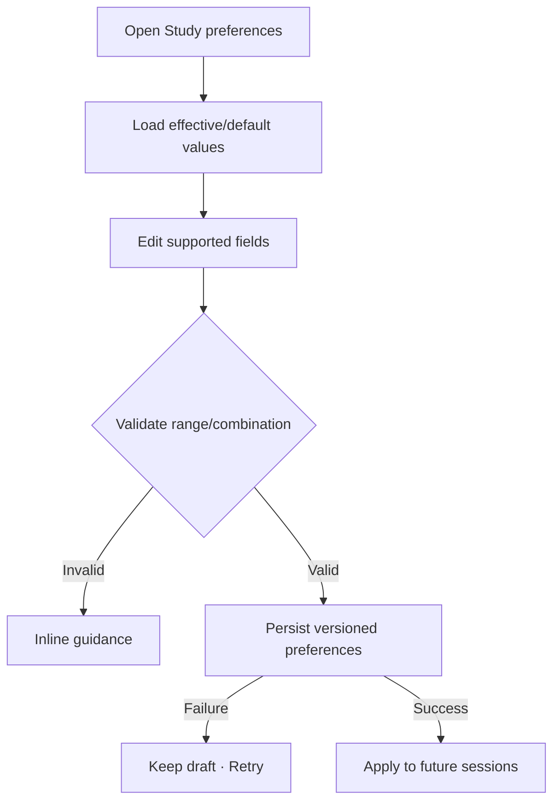

# Đặc tả UI/UX hoàn chỉnh — Configure Study Preferences

Flow này cấu hình defaults cho session/SRS trong phạm vi product hỗ trợ và chỉ áp dụng cho session mới.

## 1. Nguyên tắc đã chốt

- Mỗi field có default, range và compatibility version rõ.
- Session active giữ effective preference snapshot cũ.
- Preference không rewrite completed Attempts/Progress.
- Invalid combination bị chặn trước Save.
- Unknown persisted values fallback riêng từng field.

## 2. Master flow

## 3. Objective và composition

- Objective: điều chỉnh cách session mới hoạt động.
- Archetype: Grouped Settings form.
- Controls có unit/range/default explanation; Save là primary khi có draft.

## 4. Lifecycle

- Dirty Back xác nhận discard khi có nhiều field.
- Save locks edited controls và dedupe request.
- Active Session banner nêu thay đổi áp dụng lần sau.
- Restore group default là explicit secondary action.

## 4.1 SRS v1 boundary

- MemoX v1 dùng policy cố định `leitner-8-box-v1` theo `learning-progress/srs-8-box-policy.md`.
- Settings được hiển thị tám box và interval `1 · 3 · 7 · 14 · 30 · 60 · 120` ở dạng read-only.
- User không đổi số box, interval, thuật toán lapse hoặc policy id trong v1.
- New-card limit có thể là preference nếu flow/decision table riêng chốt range và default; thay đổi chỉ áp dụng khi dựng session mới.
- Thay đổi SRS model trong tương lai cần policy version, migration và impact review; không mutate current Progress im lặng.

## 5. State matrix

- Defaults/custom/mixed, invalid ranges/combinations.
- Active session present, saving/failure/success, compatibility fallback.
- Keyboard, large font, narrow, light/dark.

## 6. Acceptance criteria

- Session active/history không bị rewrite.
- Invalid preference không persist.
- Future Session nhận effective snapshot mới.
- Failure giữ draft và prior persisted values.
